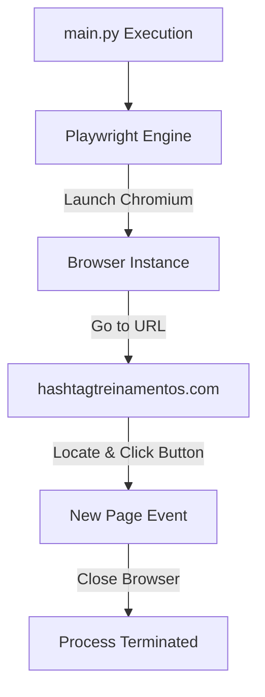

# Lab Playwright

[](https://www.python.org/)
[](https://playwright.dev/)

## Table of Contents

- [Context](#-context)
- [Software features](#-software-features)
- [Technologies and tools](#-technologies-and-tools)
- [Architecture](#-architecture)
- [Repository structure](#-repository-structure)
- [Requirements](#-requirements)
- [How to run](#-how-to-run)
- [Author](#-author)

# 📌 Context 

This is a study project designed to explore how the Playwright library works in Python for browser automation, web scraping, and E2E testing. The script automates opening a page, locating elements, simulating user interaction (clicks), and managing page contexts.

## 🚀 Software features

- **Browser Automation:** Automates launching a Chromium browser in non-headless mode.
- **Dynamic Selectors:** Utilizes Playwright's role-based locators to target specific link elements.
- **Multiple Page Handling:** Handles browser contexts and dynamically waits for new pages to open upon click actions.

## 🛠️ Technologies and tools

- Python 3.11
- Playwright (Sync API)

## 📋 Architecture



## 📂 Repository structure

```text
- 📂 lab-playwright/
  - 📄 main.py (Entry point executing Playwright sync automation)
  - 📄 requirements.txt (Dependencies file)
```

## 📦 Requirements

- Python 3.11+
- Playwright system browser dependencies (installed via command line)

## ⚙️ How to run

### 1. Clone the Repository
Clone the repository to your local machine:
```bash
git clone https://github.com/MatheusRodri/lab-playwright.git
cd lab-playwright
```

### 2. Set Up a Virtual Environment (Optional but Recommended)
Create and activate a virtual environment:

**On Windows (PowerShell):**
```powershell
python -m venv venv
.\venv\Scripts\Activate.ps1
```

**On Windows (Command Prompt):**
```cmd
python -m venv venv
.\venv\Scripts\activate.bat
```

**On Linux/macOS:**
```bash
python3 -m venv venv
source venv/bin/activate
```

### 3. Install Dependencies & Playwright Browsers
Install the required packages from `requirements.txt` and run the Playwright browser installer:
```bash
pip install -r requirements.txt
playwright install
```

### 4. Run the Project
Run the script to execute the browser automation:
```bash
python main.py
```

## 👤 Author

Matheus Rodrigues 
[LinkedIn](https://linkedin.com/in/matheus-rodrigues-mrj) [GitHub](https://github.com/MatheusRodri)